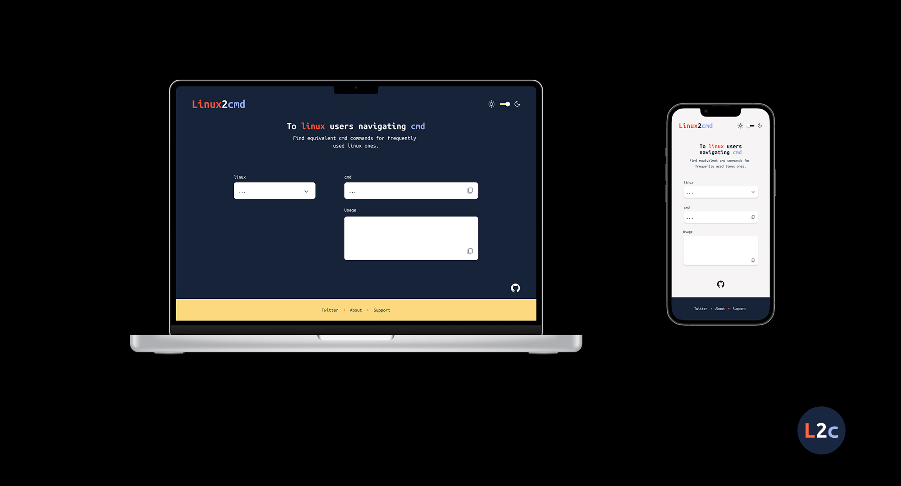

# Linux2cmd

#### Table of Contents

[Intro](#intro)

[Tech Stack](#techStack)

[Run Locally](#run)

[Contribute](#contribute)

[Design Files](#design)

[Donate](#donate)

---

<a name="intro"/>

## Intro

Recently, i've found myself working more with VM's running on Microsoft Windows OS and as such, have intereacted greater with Command Prompt `cmd`.

Many times, i'd want to run a command that I know in `linux` but not on `cmd`. It would often take me anywhere betweeen a few seconds and minutes to find the right command which I found frustrating at times :rage:

I thought to build this project to help more `linux` oriented engineers potentially save time. Hope you enjoy and possibly find this useful!

You can [visit the website here](https://linux2cmd.netlify.app/) to get going! :rocket:

<a name="techStack"/>

## Tech Stach

- Figma
- React
- Netlify

<a name="run"/>

## Run Locally

lorem Ipsum

<a name="contribute"/>

## Contribute

lorem Ipsum

<a name="design"/>

## Design Files

If you're interested, see the [original design files](https://www.figma.com/file/JpMfUQs16bbFBo5ZeElkhK/Linux2cmd?node-id=0%3A1) for this project created with Figma. 

Staying true to the designer in me :v::sparkles:

Below is a mock up of what I originally intended but as always, some details changed while building.

<a name="donate"/>

## Donate

If you've found this project useful, please feel free to contribute to its success by dropping a kind donation. kindly [follow the this link](https://gofund.me/cf7907e1) for more details. Thank you :hearts:

